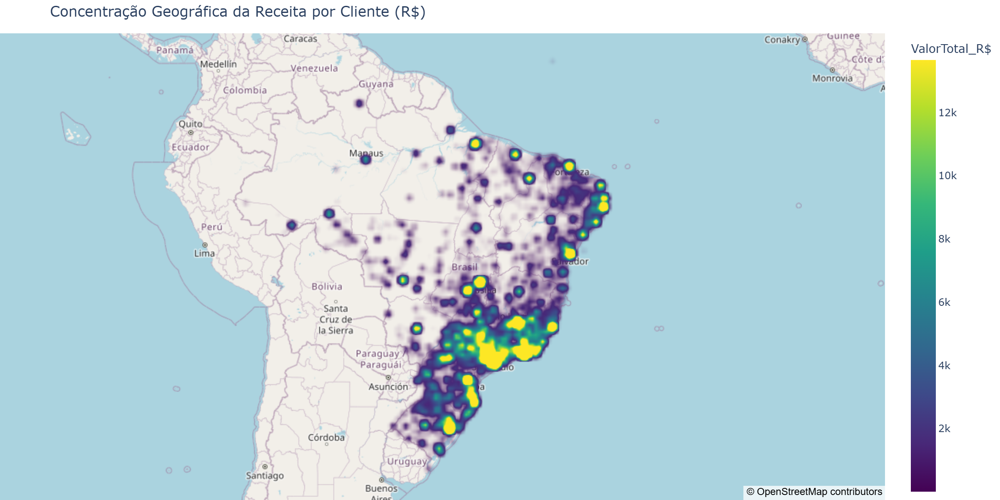
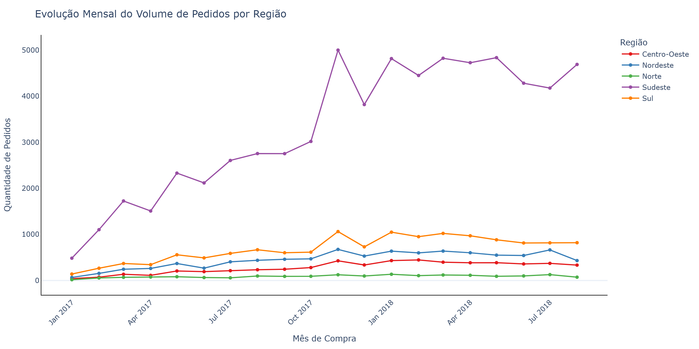
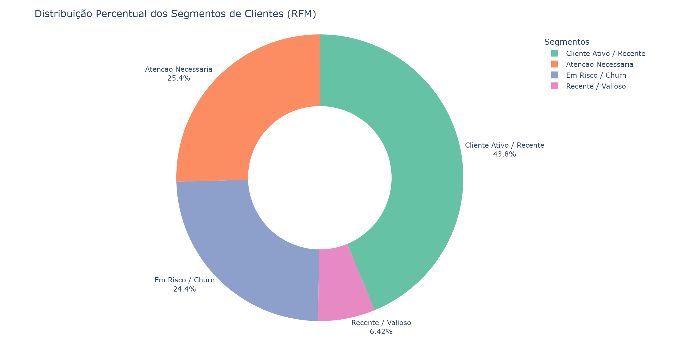
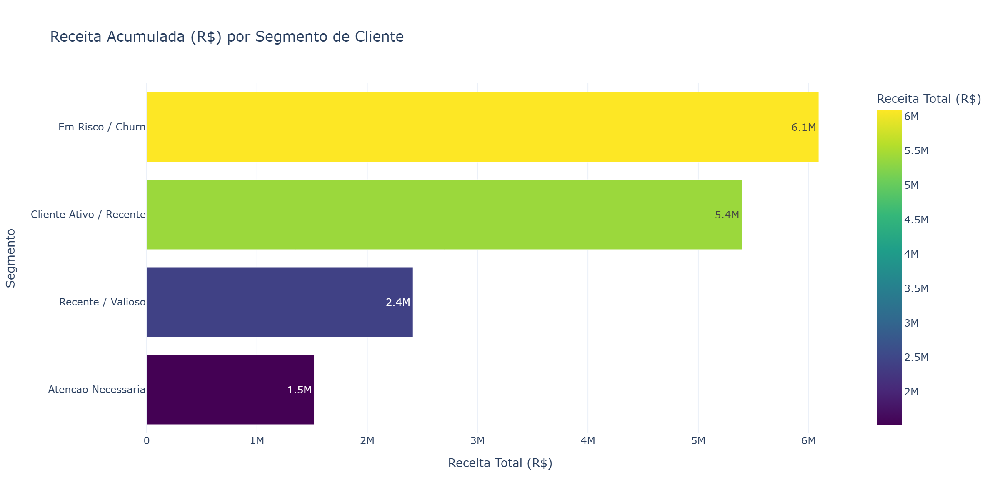
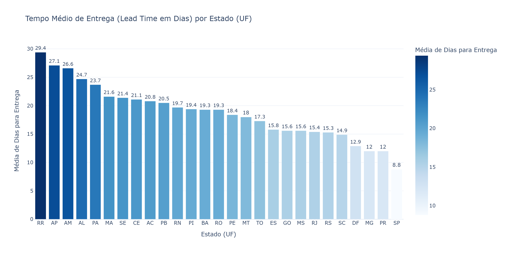

# Brazilian E-Commerce Data Analysis & Insights

Este repositório contém um projeto ponta a ponta de Análise, Engenharia de Dados e Business Intelligence aplicado a um ecossistema de E-Commerce no Brasil. O projeto abrange desde o provisionamento de banco de dados relacional em ambiente containerizado e consultas SQL até o desenvolvimento de um pipeline de ETL em Python, criação de Data Marts analíticos, modelagem de segmentação de clientes (RFM) e construção de painéis de visualização.

## Fonte dos Dados

* Dataset: Brazilian E-Commerce Public Dataset by Olist
* Origem: Kaggle (dados reais e anonimizados do e-commerce brasileiro)
* Período de Cobertura: Pedidos realizados entre 2016 e 2018

## Arquitetura, Engenharia de Dados e Pipeline ETL

### 1. Ambiente Relacional (Docker & PostgreSQL)
* Provisionamento de banco de dados relacional PostgreSQL em container via Docker Compose.
* Modelagem relacional, criação de chaves (PK/FK) e gestão de esquemas via DBeaver.
* Ingestão de microdados originais em CSV para as tabelas relacionais do banco.

### 2. Consultas e Extração SQL
* Agregações e Joins complexos para consolidação de dados de clientes, pedidos, itens, pagamentos e avaliações.
* Visões (Views) e consultas otimizadas para servir de base direta para as análises em Python.

### 3. Pipeline de Tratamento, Engenharia de Features e Data Marts (Python & Parquet)
* Pipeline de transformação e limpeza de dados utilizando Pandas e PyArrow.
* Cálculo do SLA Logístico e Lead Time de entrega real vs. estimado por estado.
* Construção da Matriz RFM (Recência, Frequência e Valor Monetário) para segmentação de base de clientes.
* Geração e exportação dos Data Marts analíticos em formato Parquet para alta performance de leitura (`mart_pedidos_performance.parquet` e `mart_rfm_clientes.parquet`).


### 1. Concentração Geográfica da Receita (Mapa de Densidade)


* Diagnóstico: Alta densidade de faturamento concentrada no eixo Sudeste e Sul...


### 2. Tendência Temporal e Diversificação Regional


* Diagnóstico de Risco: Alta dependência e concentração de receita na Região Sudeste...


### 3. Segmentação de Base (Matriz RFM)


* Diagnóstico: Apenas 6.4% da base de clientes enquadra-se no perfil Recente / Valioso...


### 4. Monetização por Perfil de Cliente


* Diagnóstico: O grupo Cliente Ativo / Recente lidera o volume financeiro absoluto...


### 5. Eficiência e Gargalos Logísticos (SLA)


* Diagnóstico: Disparidade expressiva no tempo de entrega entre o Norte/Nordeste...
## Estrutura do Projeto

```text
├── assets/                           # Arquivos interativos (.html) e imagens estáticas (.png)
├── data/                             # Data Marts processados (.parquet e .csv)
├── DICIONARIO_DADOS.md               # Documentação e dicionário de dados
├── docker-compose.yml                # Configuração do container PostgreSQL
├── eda_negocio.py                    # Análise exploratória focada em regras de negócio
├── eda_tabelas.py                    # Análise estrutural das tabelas
├── eda_visualizacoes_insights.ipynb  # Notebook principal com gráficos e insights
├── eda_visualizacoes.ipynb           # Notebook de rascunho de visualizações
├── pipeline.py                       # Pipeline ETL principal
├── README.md                         # Documentação do projeto
├── requirements.txt                  # Dependências do projeto
├── test_connection.py                # Script de teste de conexão com o banco
└── upload_data.py                    # Script de carga inicial de dados no banco

